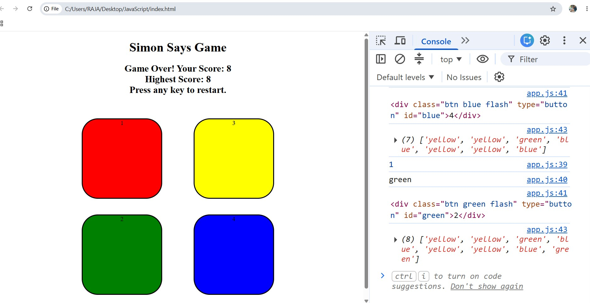

# Simon Says Game

A simple Simon Says memory game built using HTML, CSS, and JavaScript.

## Features

- Random color sequence generation
- User click detection
- Score tracking
- Highest score tracking
- Game restart after losing

## Technologies Used

- HTML5
- CSS3
- JavaScript

## How to Play

1. Press any key to start.
2. Watch the flashing color.
3. Repeat the sequence.
4. Every level adds one more color.
5. The game ends if you click the wrong color.

## Screenshot

## Author

Raja Kumar